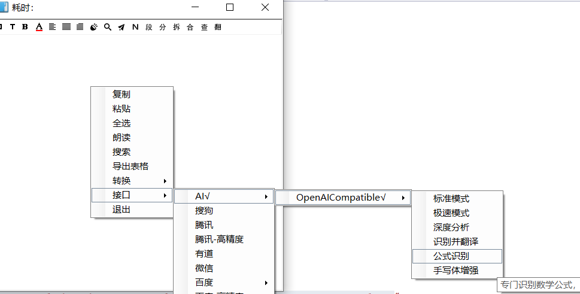

# AI 接口指南

## OpenAICompatible

此接口为 **openai 兼容接口**，只要 AI 厂商提供了兼容 OpenAI 格式的 API 接入方式，就可以使用它。

您可以根据需求在配置文件中定义多种“模式（**Modes**）”，实现一键切换不同的 **Prompt** 和模型参数。



------

## 1. 核心运行逻辑

程序在调用 AI 接口时，会遵循以下优先级确定使用的配置：

1. **菜单选中模式**：如果您在右键接口菜单中勾选了特定模式，程序优先使用该模式。
2. **配置文件首项**：如果从未选择过模式，但设置里选择了配置文件，程序会**自动加载配置文件中的第一个模式。**
3. **内置默认模式**：如果设置里不选择配置文件、配置文件不存在、路径错误或格式非法，程序将启用 **硬编码的内置兜底模式** 以确保功能可用。

------

## 2. 内置默认模式 (Hardcoded Default)

当环境未检测到有效的 `.json` 配置文件时，程序将自动应用以下内置逻辑：

### A. OCR 默认模式

- **System Prompt**: `You are a professional OCR engine. Recognize the text in the image and output it directly. Do not use markdown code blocks. Do not output any conversational filler. Maintain the original line breaks. If the image contains code, remember to preserve the formatting.`
- **User Prompt**: `OCR this image.`
- **参数**: Temperature = `0.1` (高确定性)，禁用 Thinking 模式。

### B. 翻译默认模式（中英互译）

- **System Prompt**: `You are a professional translator. Translate the user input directly, without any explanations`
- **User Prompt**: `Translate the following text. If it is in Chinese, translate to English. Otherwise, translate to Simplified Chinese. Do not explain:`
- **参数**: Temperature = `1.0` (更具创造性)，禁用 Thinking 模式。

------

## 3. 配置文件样式 (.json)

配置文件可以放在任意地方，推荐存放在程序目录下的 `Data` 文件夹中。

如果 OCR 配置文件名为 `AIOCRConfig.json` 且存放在程序目录下的 `Data` 文件夹，则接口设置里无需填写 "**配置文件**" 这一项，程序会自动使用该文件

如果翻译配置文件名为 `AITranslateConfig.json`，存放在程序目录下的 `Data` 文件夹，则接口设置里无需填写 "**配置文件**" 这一项

OCR 配置文件和翻译配置文件基本相同，除了 `type` 字段不同：一个值是 `ocr`，一个值是 `translate`。另外翻译配置文件里的提示词支持占位符，以便替代为接口设置里的源语言和目标语言

### 完整 JSON 模板

#### OCR 配置文件模板

```json
{
  "type": "ocr", //必选，值为ocr或transalte
  "modes": [
    {
      "mode": "精确识别",//必选，代表模式名称，可任意
      "description": "去除干扰，保留原始换行格式",//可选，鼠标悬停模式菜单的提示信息
      "system_prompt": "你是一个专业的 OCR 引擎。请直接识别图片中的文字并输出，不要包含任何解释或 Markdown 代码块。",//和prompt至少有一个
      "prompt": "请识别这张图片中的文字：",//和system_prompt至少有一个
      "temperature": 0.1,//可选，不写则使用ai厂商设定的模型默认值
      "enable_thinking": false//可选，不写则使用ai厂商设定的模型默认值
    }
  ]
}
```

#### 翻译 配置文件模板

```json
{
  "type": "translate", //必选，值为ocr或transalte
  "modes": [
    {
      "mode": "深度翻译",//必选，代表模式名称，可任意
      "description": "使用思考模型进行中英互译",//可选，鼠标悬停模式菜单的提示信息
      "system_prompt": "你是一个精通 ${fromlang} 和 ${tolang} 的翻译专家。",//和prompt至少有一个
      "assistant_prompt": "我会遵循学术风格进行润色。",//可选
      "prompt": "请将以下内容翻译为 ${tolang}：",//和system_prompt至少有一个
      "temperature": 1.0,//可选，不写则使用ai厂商设定的模型默认值
      "enable_thinking": true//可选，不写则使用ai厂商设定的模型默认值
    }
  ]
}
```


### 字段详细说明

注意：`system_prompt`和`prompt`至少有一个，推荐两个都有

| **字段名**           | **必填**                      | **说明**                                                     |
| -------------------- | ----------------------------- | ------------------------------------------------------------ |
| **type**             | 是                            | 必须为 `"ocr"` (用于识别) 或 `"translate"` (用于翻译)。程序会校验此项，若类型不匹配（例如在翻译功能中加载了 OCR 配置文件）将报错拦截。 |
| **mode**             | 是                            | 模式名称，会显示在模式切换菜单中。                           |
| **description**      | 否                            | 鼠标悬停在模式菜单上时显示的提示文字。                       |
| **system_prompt**    | 和**prompt**至少有一个        | 发送给 AI 的系统角色指令。<br />若字段缺失或为空，程序不会向 API 发送 `system` 角色消息。 |
| **assistant_prompt** | 否                            | 可模拟 AI 的历史回复，用于引导输出格式。若缺失则忽略此环节。 |
| **prompt**           | 和**system_prompt**至少有一个 | 用户指令的前缀。翻译模式下会自动拼接用户选中的文本。<br />**OCR 模式下**若字段缺失，程序会只发纯图片消息；**翻译模式下**若字段缺失，程序会只发原文文本。 |
| **temperature**      | 否                            | 采样温度（0-2），支持小数，数值越低结果越严谨稳定（更富确定性），数值越高结果越随机（更富创造力）。<br />**若字段缺失**，程序将不向接口发送该参数，此时 AI 会采用该厂商定义的 **API 默认值**。 |
| **enable_thinking**  | 否                            | 是否开启思考模式 (如 GLM-4.5-flash)。可选值：`true`/`false`。此参数是否生效取决模型是否支持设置。<br /> **若字段缺失**，程序将不发送此参数，模型按该厂商定义的默认逻辑决定是否思考。 |

------

## 4. 翻译变量支持

在翻译配置的三种 Prompt 中，您可以使用以下占位符，程序会在执行时自动替换：

- **`${fromlang}`**: 接口设置的源语言（如：Auto Detect）。
- **`${tolang}`**: 接口设置的目标语言（如：Simplified Chinese）。

**示例**: `"请将内容从 ${fromlang} 翻译为 ${tolang}"`。

